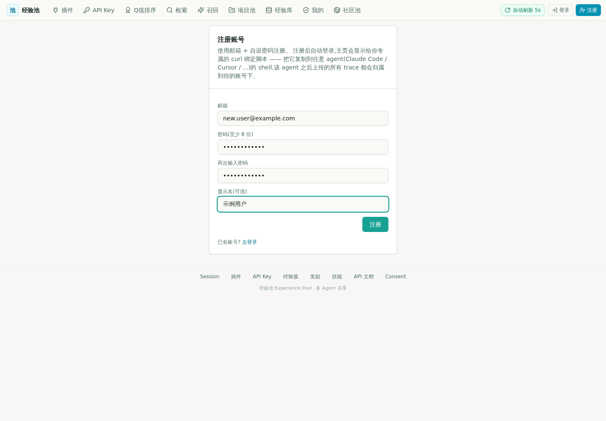
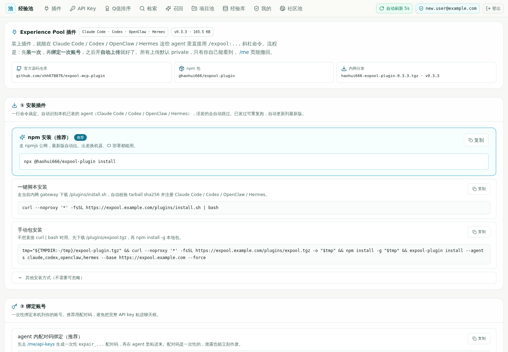
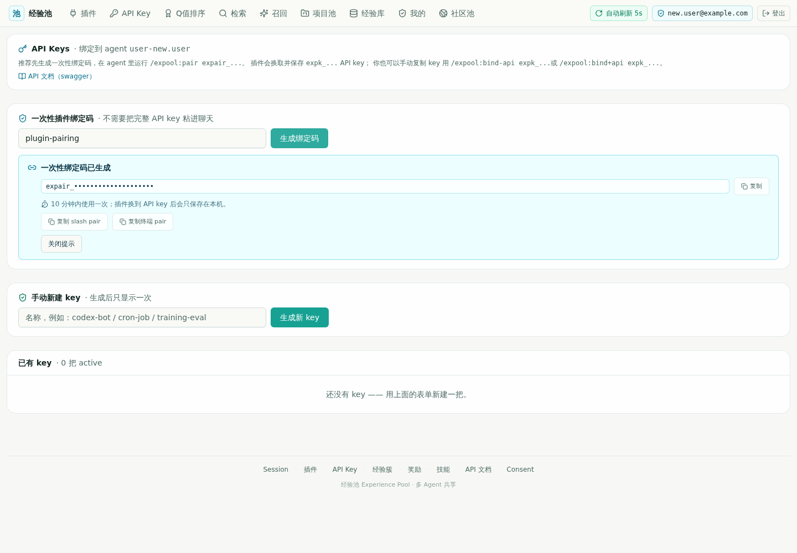
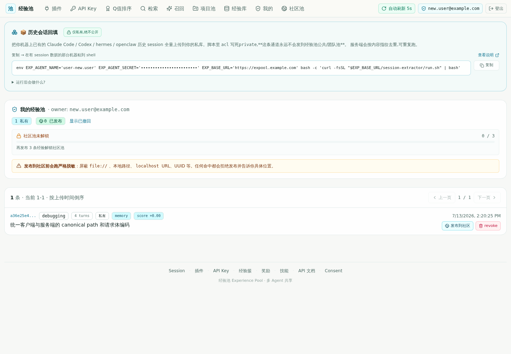

# Experience Pool 新用户接入手册

这份手册面向第一次使用 Experience Pool 的成员。按顺序完成后，Claude Code（下文简称 CC）和 Codex 都可以：

- 把本机历史 session 首次导入个人私有经验池；
- 后台增量上传新 session；
- 在处理新任务前，从个人池自动召回相似经验。

全程默认 `acl=private`，也就是只有账号本人可见。发布到社区池必须单独操作，不会因为安装插件或开启自动上传而自动公开。

## 开始前

准备以下内容：

1. 团队提供的 Experience Pool 门户地址；
2. 已安装 Node.js 18 或更高版本，并能使用 `npx`；
3. 本机至少安装了 CC 或 Codex 其中一个。

部署管理员应把生产门户配置在 `EXP_UI_PUBLIC_URL`，把可供插件访问的统一网关配置在 `EXP_PUBLIC_BASE_URL`。用户不要使用 `127.0.0.1` 或其他机器的本地端口作为门户地址。

## 1. 注册账号

1. 打开团队提供的门户地址。
2. 点击右上角 **注册**。
3. 填写邮箱、至少 8 位的密码和可选显示名。
4. 点击 **注册**。注册成功后会自动登录。



如果页面没有注册入口，说明管理员关闭了开放注册，需要向管理员申请账号或注册口令。

## 2. 安装插件

登录后打开顶部导航的 **插件** 页面。推荐在准备使用 CC / Codex 的同一台机器上执行：

```bash
npx @haohui666/expool-plugin install
```

安装器会自动识别本机 runtime，并注册 CC / Codex 所需的 MCP、命令和 Codex prompts。安装完成后，关闭并重新打开正在运行的 CC 和 Codex，让新增命令生效。



可以先做一次本机检查：

```bash
npx @haohui666/expool-plugin doctor
```

## 3. 用一次性配对码绑定账号

推荐使用一次性配对码，不要把长期 API Key 粘贴进聊天窗口。

1. 登录门户，打开顶部导航的 **API Key**。
2. 在“一次性插件绑定码”区域点击 **生成绑定码**。
3. 在 10 分钟内使用这串 `expair_...`。配对码只能成功使用一次。



最稳妥的方式是在终端绑定，绑定结果会同时供 CC 和 Codex 使用：

```bash
npx @haohui666/expool-plugin pair expair_你的配对码
```

也可以在 agent 内绑定：

| 客户端 | 命令 |
|---|---|
| Claude Code | `/expool:pair expair_你的配对码` |
| Codex | `/prompts:expool-pair expair_你的配对码` |

配对成功后不要在任何文档、截图或 issue 中保留真实配对码或 `expk_...` 长期密钥。

## 4. 验证绑定

任选一种方式检查：

| 客户端 | 命令 |
|---|---|
| 终端 | `npx @haohui666/expool-plugin status` |
| Claude Code | `/expool:status` |
| Codex | `/prompts:ep status` |

验收重点：

- `configured` 为已配置；
- 显示的 `agent_name` 属于当前账号；
- `gateway` 是团队门户的可访问地址，而不是 `127.0.0.1`。

## 5. 首次导入历史 session

首次接入建议扫描 CC 和 Codex 的全部历史 session。上传固定进入当前账号的私有池，服务端会按内容指纹去重。

### Claude Code

```text
/expool:detect
/expool:upload-all --sources claude-code,codex --full --yes
```

### Codex

```text
/prompts:expool-detect
/prompts:expool-upload-all --sources claude-code,codex --full --yes
```

`--full` 表示首次重新扫描所有历史记录；`--yes` 跳过二次确认。首轮耗时取决于本机 session 数量和长 session 大小，完成后不需要反复全量运行，后续使用增量自动上传即可。

结果字段含义：

| 字段 | 含义 |
|---|---|
| `uploaded` | 本轮真正上传的 session 数 |
| `skipped` | 已处理或已存在，因此跳过；不是失败 |
| `failed` | 真正失败的数量；大于 0 时应查看对应错误 |

上传后打开门户的 **我的** 页面。新经验应该显示在“我的经验池”中，并标记为私有。



长 session 会保留完整原始 session，同时切分为更小的 `context -> action -> outcome` 检索单元。检索先命中小单元，需要时仍可回到对应完整 session 查看上下文。

## 6. 开启自动上传

推荐同时采集 CC 和 Codex：

```bash
npx @haohui666/expool-plugin auto on \
  --sources claude-code,codex \
  --run-now --verbose
```

对应的 agent 命令：

| 客户端 | 开启命令 |
|---|---|
| Claude Code | `/expool:auto-on --sources claude-code,codex --run-now --verbose` |
| Codex | `/prompts:expool-auto-on --sources claude-code,codex --run-now --verbose` |

后台调度器不会在聊天窗口里一直显示进度条。`--run-now --verbose` 会在开启时前台执行一轮，之后用下面的命令查看状态和日志：

| 操作 | 终端 | Claude Code | Codex |
|---|---|---|---|
| 查看状态 | `expool-plugin auto status` | `/expool:auto-status` | `/prompts:expool-auto-status` |
| 前台跑一轮 | `expool-plugin auto tick --verbose` | `/expool:auto-tick --verbose` | `/prompts:expool-auto-tick --verbose` |
| 查看日志 | `expool-plugin auto logs` | `/expool:auto-logs` | `/prompts:expool-auto-logs` |
| 关闭 | `expool-plugin auto off` | `/expool:auto-off` | `/prompts:expool-auto-off` |

## 7. 开启自动召回

默认从个人私有池取最多 3 条强相关经验：

```bash
npx @haohui666/expool-plugin recall on \
  --targets claude,codex \
  --scope personal \
  --top-k 3
```

也可以在 agent 内执行：

| 客户端 | 命令 |
|---|---|
| Claude Code | `/expool:recall-on --targets claude,codex --scope personal --top-k 3` |
| Codex | `/prompts:expool-recall-on --targets claude,codex --scope personal --top-k 3` |

两端的实现方式不同：

- CC 使用 `UserPromptSubmit` hook，在非简单任务提交前请求 RAG context；
- Codex 没有同级 hook，插件会在 `~/.codex/AGENTS.md` 写入受管契约，要求非简单任务先检索再处理。

查看状态：

```bash
npx @haohui666/expool-plugin recall status
```

也可以分别使用 `/expool:recall-status` 和 `/prompts:expool-recall-status`。正常状态下应看到 CC hook 和 Codex AGENTS 契约均已启用，`scope=personal`。

手动验证一次召回：

| 客户端 | 示例 |
|---|---|
| Claude Code | `/expool:prep 修复 FastAPI HMAC 签名失败` |
| Codex | `/prompts:ep rag 修复 FastAPI HMAC 签名失败` |

命令后的自然语言不必加引号。短语通常比单个关键词更稳定，建议同时包含技术名、错误现象和当前子目标。

## 8. 日常命令速查

| 目的 | Claude Code | Codex |
|---|---|---|
| 搜索历史经验 | `/expool:search <问题>` | `/prompts:ep search <问题>` |
| 生成精简 RAG 上下文 | `/expool:rag-search <问题> --scope personal` | `/prompts:ep rag <问题>` |
| 上传当前 session | `/expool:upload` | `/prompts:ep upload` |
| 列出个人经验 | `/expool:list` | `/prompts:ep list` |
| 查看一条完整经验 | `/expool:get <id8>` | `/prompts:ep get <id8>` |
| 撤回经验 | `/expool:revoke <id8>` | `/prompts:ep revoke <id8>` |
| 给最近召回正反馈 | `/expool:feedback --last --reward 1 --reason helped` | `/prompts:ep feedback --last --reward 1 --reason helped` |

## 隐私边界

- 批量上传、自动上传和当前 session 上传默认都是 `private`。
- 只有明确执行发布命令，经验才会进入社区池或团队池。
- 一次性配对码 10 分钟内有效且只能使用一次；长期 API Key 不要发到聊天或公开仓库。
- 个人私有库不做发布前的强制隐私拦截；公开或团队发布仍会执行安全检查。因此私有库也应避免主动写入明文密码、token 和客户敏感数据。
- 已上传内容可在门户 **我的** 页面撤回，也可以用 `/expool:revoke <id8>`。

## 常见问题

### 安装后看不到命令

完全退出并重启 CC / Codex，再运行：

```bash
npx @haohui666/expool-plugin install --force
npx @haohui666/expool-plugin doctor
```

### 绑定状态显示未配置或出现 401

重新在门户生成一次 `expair_...` 配对码并绑定。不要重复使用旧配对码。

### 检测不到历史 session

先确认本机确实运行过对应 agent，再执行 `/expool:detect` 或 `/prompts:expool-detect`。`available_now` 表示本机当前可识别的 session 总数。

### 上传结果是 `uploaded=0, skipped=N`

这通常表示这些 session 已经上传过或本轮没有新增内容，并非上传失败。只有 `failed > 0` 才需要排查。

### 自动上传没有进度条

后台任务不会持续占用聊天窗口。使用 `auto tick --verbose` 前台观察一轮，或使用 `auto logs` 查看后台日志。

### Codex 自动召回没有触发

先运行 `expool-plugin recall status`，确认 `codex_enabled` 已开启；随后重启 Codex，让新的 `~/.codex/AGENTS.md` 契约在新会话中生效。

### 页面或插件命令指向 `127.0.0.1`

这是部署配置错误，不是用户本机应该使用的地址。管理员需要在生产环境设置 `EXP_UI_PUBLIC_URL`、`EXP_PUBLIC_BASE_URL` 和 `EXP_BIND_BASE_URL`，然后重新构建 UI、重启服务。

## 接入完成检查表

- [ ] 能登录门户，右上角显示自己的邮箱；
- [ ] `expool-plugin doctor` 没有关键失败；
- [ ] 状态页显示当前账号和可访问的 gateway；
- [ ] 首次全量上传的 `failed=0`；
- [ ] 门户 **我的** 页面能看到私有经验；
- [ ] 自动上传状态为运行中；
- [ ] 自动召回状态显示 CC / Codex 目标已启用；
- [ ] 用一个真实技术问题可以召回相关经验。
